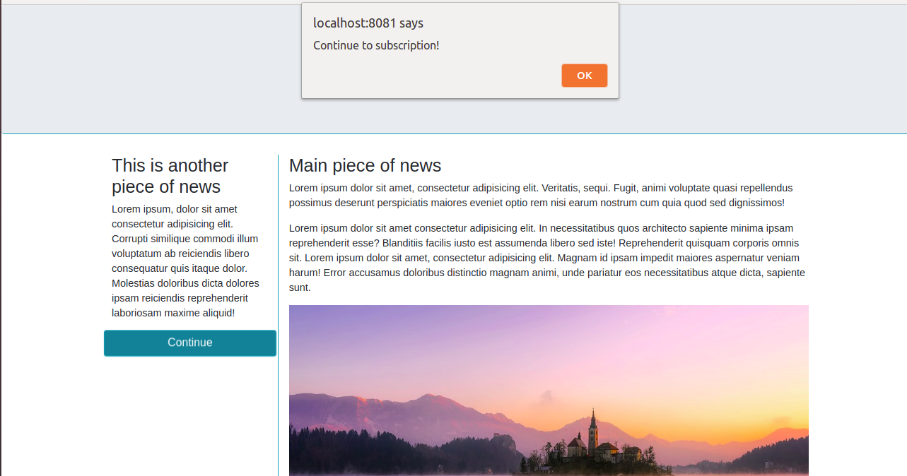

# Fetch - Async Await

**Instructions**:
* Tested with Node version 17 - older versions might not work!
* Convert the promise that handles the modal popup in the `index.js` file to use `async await` syntax.
* In the `main.scss` there is an animation on the "Continue" button on the page. Create a promise which executes code upon the button's animation end. **You must use the `async await` syntax.**
* Upon the animation end, display an alert saying "Continue to subscribe", and change the background color of the button.
* There are many ways to complete the tasks, feel free to experiment :)

