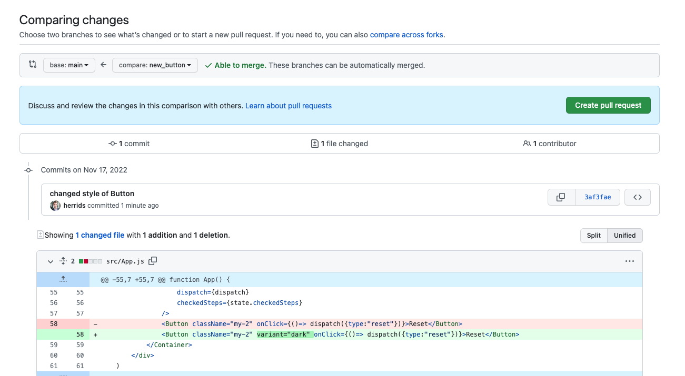
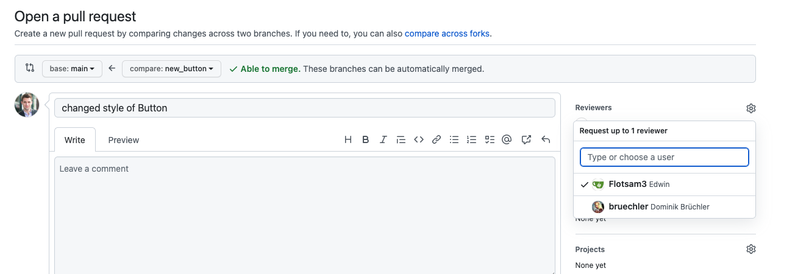

# Deployment

### Branches
In einem Team von Entwicklern würdet ihr nicht alle im selben branch arbeiren, da man sonst das Überschreiben von Code riskieren würde. Von daher arbeitet man mit Feature branches.
Es gibt einen Hauptbranch (häufig mit dem namen main oder, prod, int...) und für jede Änderung würde man einen neuen branch anlegen. der CLI Befehl dafür ist:

`git checkout -b <branch_name>` 

oder `git branch <branchname>` plus `git checkout <branch_name>`

### Pull Requests
Wenn ihr fertig seid mit euren Änderungen würdet ihr einen Pull Request erstellen, um eure Änderungen in den Hauptbranch zu mergen. 

Dabei gilt häufig das sogenannte 4 oder 6 Augen Prinzip, sprich ihr habt mindestens eine Person, die über euren Code schaut bevor dieser gemerged wird und approved die Änderung.

